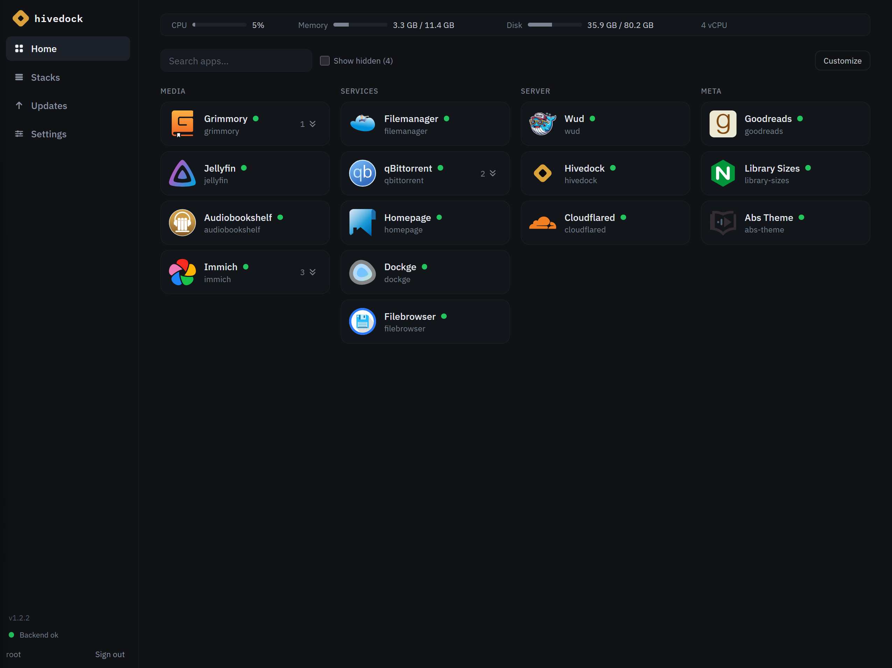
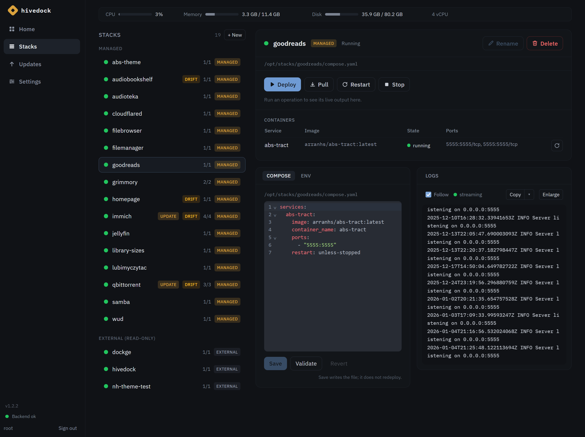
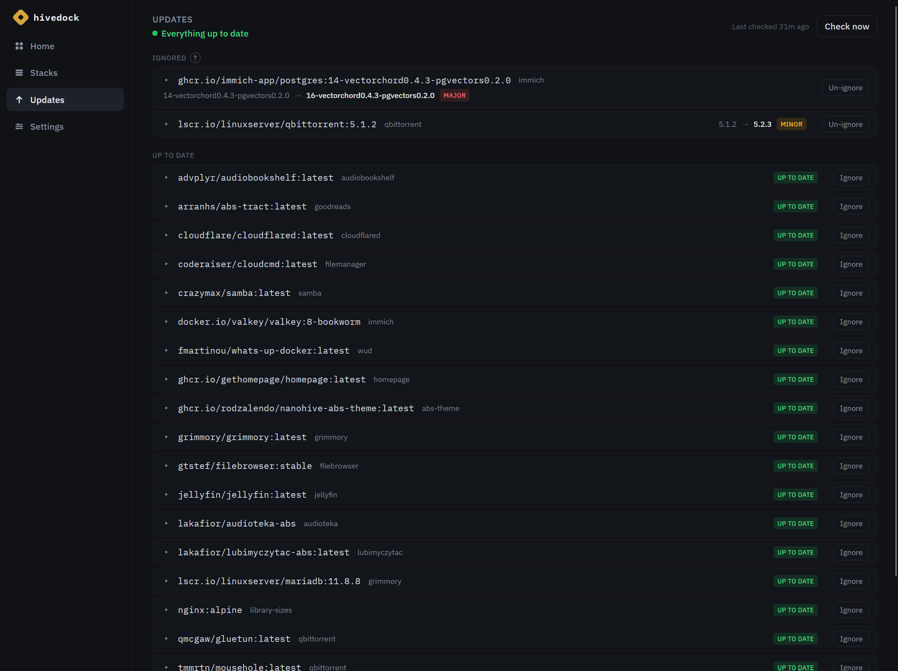
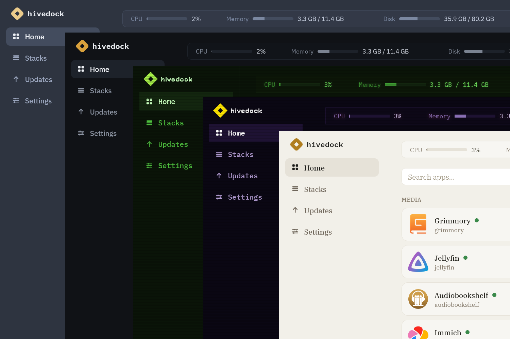
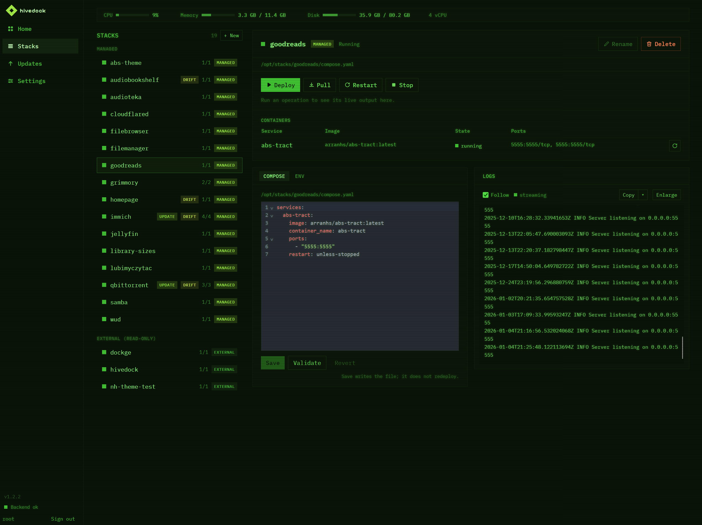
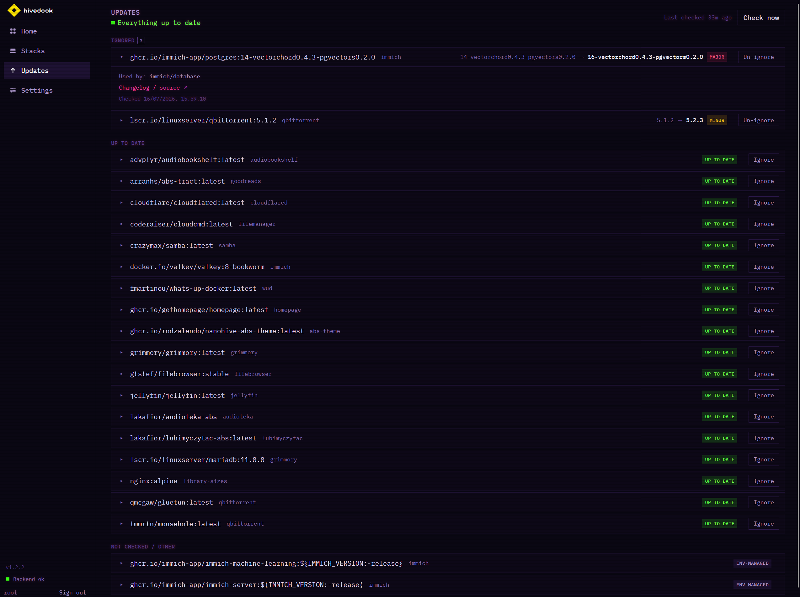
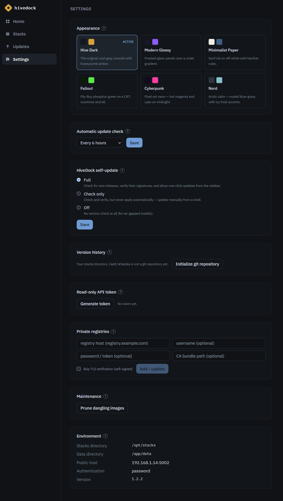

<p align="center">
  
</p>

<h1 align="center">HiveDock</h1>

<p align="center"><b>Manage your Docker Compose stacks, get an app dashboard that builds itself, and check for image updates. One small container for one home server.</b></p>

<p align="center">
  <code>docker compose up -d</code>, point it at your stacks folder, done.
</p>

<p align="center">
  
</p>

---

## What it's for

If you run Compose on one box, you probably juggle three tools: one to manage stacks, one for a start page, and one to check for updates. HiveDock rolls all three into one container, and because it reads your compose files and talks to Docker directly, the three parts actually know about each other.

The nice part is what you get for free:

- The dashboard builds itself from what's running, so it can't go stale.
- Update checks know your current version, so an old leftover tag can't pose as an upgrade.
- Your compose files stay the source of truth. HiveDock shows them, it never copies them into a database. Delete the container and every stack keeps running.

You keep your SSH-and-YAML workflow. You just get a UI that respects it.

## Stacks



Every stack and container in one list. Edit compose and `.env` in the browser (validated before it saves), then deploy, pull, restart, or stop with the output streaming live. Restart a single service without touching the rest, tail per-service logs, and if a running container drifts from its file you get a badge that explains why. Failing health checks are flagged too, so a container that's running but unhealthy stands out. Containers you didn't create show up too, read-only, so nothing on screen is a lie.

## Dashboard

Your apps appear on their own, with the right icons and clickable links, all pulled from your compose files and containers. There's no dashboard YAML to write. Apps behind a VPN sidecar (like qBittorrent behind gluetun) get their link figured out automatically, and a header strip counts what's active, inactive, and exited. Rename cards, swap icons, group things, hide the plumbing, drag stuff around, and it all saves on the server. Old `homepage.*` labels are read as-is, so switching over costs you nothing.

## Updates



HiveDock checks Docker Hub, GHCR, LinuxServer, Quay, and any other v2 registry, with logins and custom TLS for the private ones. It only suggests versions on your track and cross-checks build dates, so a stale tag never looks like a new release. When there's an update you apply it right from the app: it rewrites just the `image:` line in your compose file (comments and formatting intact) and redeploys, one image or all at once. Nothing updates on its own unless you click. Pin anything you want to stay on.

## Themes



Six looks to pick from in Settings: Hive Dark, Modern Glossy, Minimalist Paper, Fallout, Cyberpunk, and Nord. They re-skin the whole app, not just the sidebar. The UI also speaks English, Polish, German, Spanish, and French. Here's Stacks in Fallout and Updates in Cyberpunk:

<p align="center">
  
  
</p>

## It updates itself too



HiveDock watches for its own new release and updates with one click from the sidebar. Releases are cosign-signed, and it verifies the signature and pins the exact image before it touches anything. You also get a read-only API token for monitoring tools, one-click cleanup of old image layers, and an automatic switch to read-only mode if your stacks folder isn't mounted the way Compose needs.

## HiveDock vs. the usual trio

| | Dockge / Portainer | Homepage / Heimdall | Watchtower / WUD | HiveDock |
|---|:--:|:--:|:--:|:--:|
| Manage compose stacks | ✅ | | | ✅ |
| App dashboard, no config | | ✅ (you write YAML) | | ✅ (builds itself) |
| Check for image updates | | | ✅ | ✅ |
| Apply updates from the app, when you decide | | | auto only | ✅ |
| Update itself from the app | | | | ✅ |
| Scope | one host | any | any | one host |

## Install

Make a `compose.yaml` and run `docker compose up -d`:

```yaml
services:
  hivedock:
    image: ghcr.io/rodzalendo/hivedock:latest
    container_name: hivedock
    restart: unless-stopped
    ports:
      - "5001:5001"
    environment:
      # STACKS_DIR must be the SAME path inside and outside the container.
      # Mount it 1:1 (see volumes below).
      - STACKS_DIR=/opt/stacks
      - DATA_DIR=/app/data
      - PUBLIC_HOST=192.168.1.50:5001   # how you reach the box, keeps links stable
    volumes:
      - /var/run/docker.sock:/var/run/docker.sock
      - ./data:/app/data
      - /opt/stacks:/opt/stacks
```

Open `http://<your-host>:5001`, create the admin account on the first screen, and your stacks show up right away. After that you update HiveDock itself from the sidebar.

> Tags: `:latest` is the newest stable release, `:X.Y.Z` pins one, `:edge` follows `main`. Point your own compose at `:latest` so one-click self-update stays clean.

## Configuration

Set with environment variables:

| Variable | Default | What it does |
|---|---|---|
| `PORT` | `5001` | Port to listen on. |
| `STACKS_DIR` | `/opt/stacks` | Folder scanned for `<stack>/compose.yaml`. Must be the same path inside and outside the container. |
| `DATA_DIR` | `/app/data` | SQLite and app state. |
| `PUBLIC_HOST` | request host | Host used for dashboard links, e.g. `192.168.1.50:5001`. |
| `CHECK_INTERVAL` | `30m` | How often to check for updates. `off` disables it. |
| `AUTH_TRUSTED_HEADER` | unset | SSO header with the logged-in user (needs the CIDRs below). |
| `AUTH_TRUSTED_PROXY_CIDRS` | unset | Networks your auth proxy sits in. |
| `ADMIN_USER` / `ADMIN_PASSWORD_FILE` | unset | Create the first admin without the setup screen. |
| `LOG_LEVEL` | `info` | `debug`, `info`, `warn`, or `error`. |

A single admin account is made on first run, gated by a one-time token printed to the log (grab it with `docker logs hivedock`). Sessions are an HttpOnly cookie, every change is CSRF-protected, and logins are rate-limited. Want SSO with no second login? Put HiveDock behind a forward-auth proxy (Authelia, authentik, Caddy) and set `AUTH_TRUSTED_HEADER` plus `AUTH_TRUSTED_PROXY_CIDRS`. Behind any reverse proxy, forward `X-Forwarded-Proto` (for a `Secure` cookie) and pass WebSocket upgrade headers to `/api/ws`.

### Labels (optional)

You don't need labels, but you can override any card from the compose file (or right in the UI):

```yaml
services:
  app:
    image: ghcr.io/example/app:1.2.3
    labels:
      hivedock.name: My App
      hivedock.group: Media
      hivedock.icon: jellyfin        # dashboard-icons slug or a full image URL
      hivedock.url: https://app.lan  # for host/shared-network apps
      hivedock.hidden: "true"
```

## Security

HiveDock holds the Docker socket, which is root-equivalent, so keep it on your LAN or behind a proxy that does its own auth. It doesn't phone home: no analytics, no telemetry. The only outbound calls are the version check to ghcr, the registries your stacks use, and icon lookups (cached after the first hit). Self-updates are signature-verified and digest-pinned, compose edits are byte-exact or they abort, and every file operation stays inside your stacks folder. See [THREAT_MODEL.md](THREAT_MODEL.md) and [SECURITY.md](SECURITY.md) for the details, and [`deploy/compose.hardened.yaml`](deploy/compose.hardened.yaml) for a locked-down setup. Licensed [MIT](LICENSE).

## Built with Claude

The whole codebase, backend, frontend, tests, and CI, was written with [Claude](https://claude.com). If you want the deeper docs, there's [docs/ARCHITECTURE.md](docs/ARCHITECTURE.md), [docs/PRD.md](docs/PRD.md), and [docs/DEPLOYMENT.md](docs/DEPLOYMENT.md).
